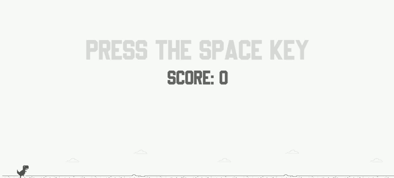

<h1 align="center">🎮 Dino Game </h1>

<h2 align="center"><a href="">🚀🦕 Clique Aqui Para Jogar 🦕🚀</a></h2>

<h2 align="center">👁‍🗨👁‍🗨</h2>
<h2 align="center">📸Scrennshot</h2>
<p>
<h1 align="center"></h1>

## 📋**Sobre**

#Nesse projeto tentei recriar o famoso jogo do dinossauro do Chrome, conhecido por muitos de seus usuários e que é exibido quando não existe nenhuma conexão com a internet disponível.

---

## 💻**Tecnologias Ultilizadas**

* [Html](https://developer.mozilla.org/pt-BR/docs/Web/Guide/HTML/HTML5)
* [JavaScript](https://developer.mozilla.org/pt-BR/docs/Web/JavaScript)
* [css](https://developer.mozilla.org/pt-BR/docs/Web/CSS)

---

## 💾**Clone Do Repositório**

```
#Para fazer clone do repositório ultilizando git use a linha de comando abaixo:

git clone 

```

---

## 📝**Licença Do Projeto**

[MIT]()